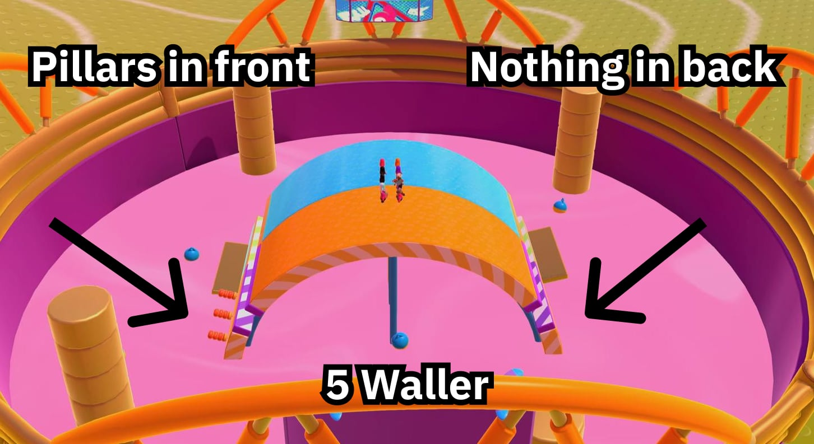
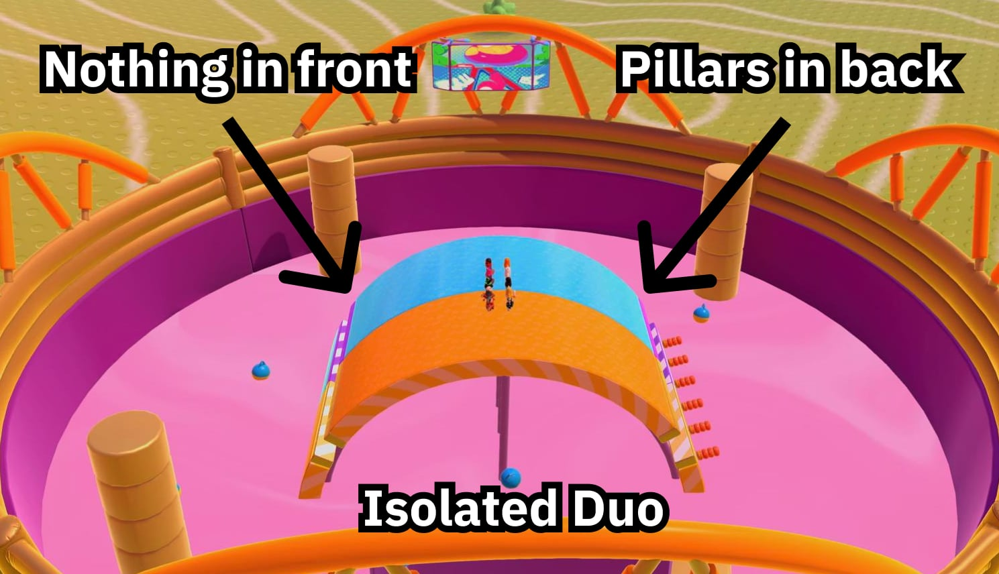
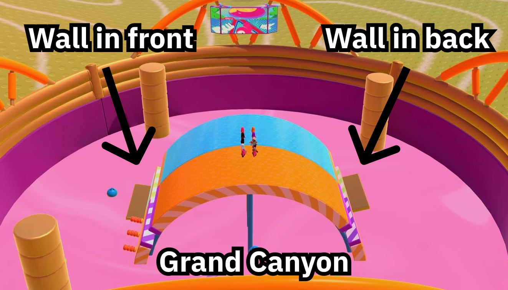
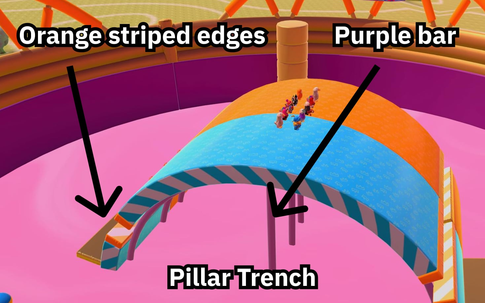
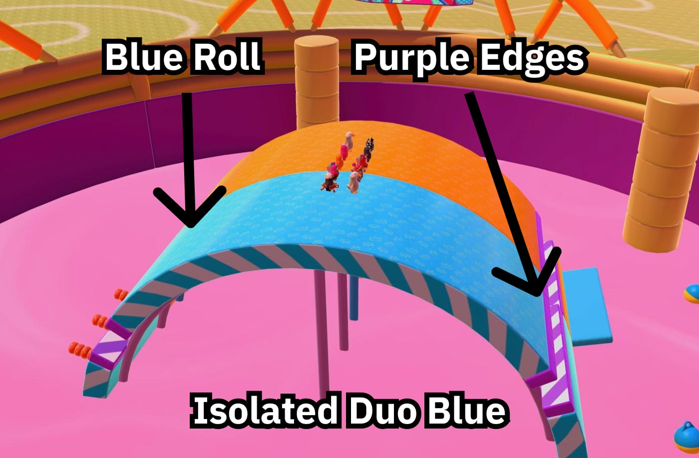

# Recognizing Variations Early

It is possible to detect the exact Roll Off variation from the preview at the start of the final. This can be convenient so that you don't have to spend the first lap trying to figure out which variation you have gotten.

Below is a simple decision tree that you can use to detect each of the orange and blue rolls from the final's opening preview.

## Rolls

The strategies you can use to detect each roll early on are described below.

### 5 Waller

5 Waller has pillars in front and nothing in back.

### Isolated Duo

Isolated Duo has nothing in front and pillars in back.

### Closed-Open & Open-Closed

Closed-Open and Open-Closed can both be recognized by the fact that they have pillars in front and pillars in back.

### Easy 4

Easy 4 has a wall in front and pillars in back.

### Grand Canyon

Grand Canyon has a wall in front and a wall in back.

Grand Canyon is the only roll with green striped inner edges and a yellow bar.

### Pillar Trench

Like Grand Canyon, Pillar Trench also has a wall in front and a wall in back.

To differentiate it from Grand Canyon, check that the roll has oranged striped inner edges and a purple bar.

## Other tips

Isolated Duo Blue can be recognized early by its purple edge color, as it is the only blue roller with purple edges.

Similarly, Open-Closed Blue can be recognized early by its gold edge color, as it is the only blue roller with gold edges.

